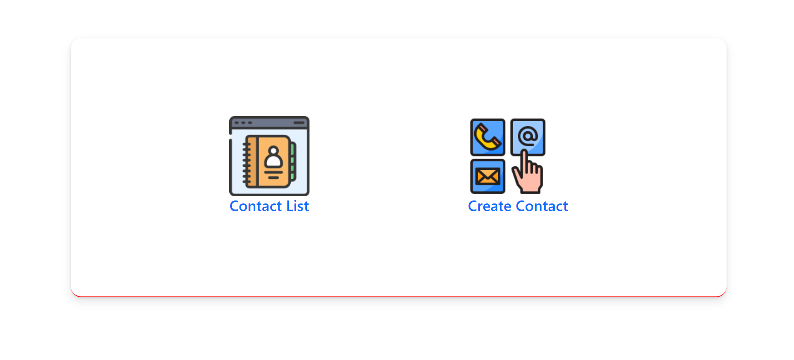
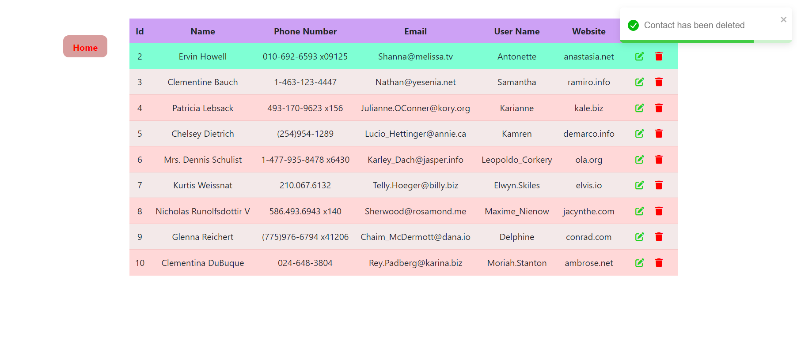
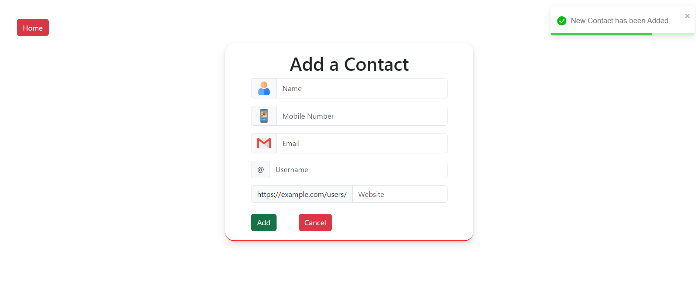

# Contact App

The Contact App is a simple and intuitive application for managing your contacts. It allows you to add, update, delete, and view a list of contacts. This application is designed to be user-friendly, making it easy to keep track of personal or professional contacts.

# Features

- **Add New Contact**: Easily add a new contact with details such as name, phone number, email, and address.
- **Update Contact**: Edit existing contact details to keep your contact information up to date.
- **Delete Contact**: Remove contacts that are no longer needed.
- **View Contact List**: View a list of all your contacts in a clear and organized manner.

# Hosted Url:
https://contact-app-qli2.onrender.com/

# Installation:

1. Clone the repository.

   https://github.com/shaikhsohel0082/Contact-App.git

2. Navigate to the project directory:

   cd Contact-App

3. Install dependencies:

```
npm install
```

4. Run the application:

```
npm start
```

## Screenshots






# License

This project is licensed under the MIT License.

# Contact

If you have any questions or feedback, feel free to reach out:

- Email: shaikhsohel0082@gmail.com
- GitHub: https://github.com/shaikhsohel0082/
